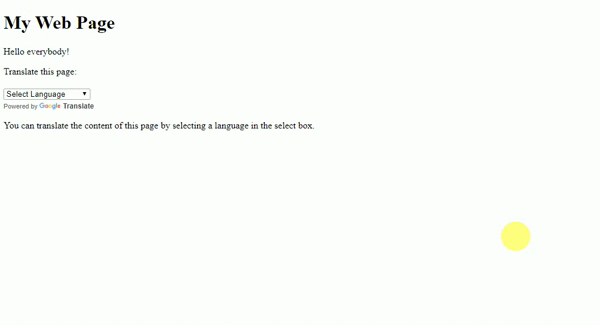

<h1>Introduction</h1>
This is a webpage translator. which can translate whole webpage into any language. Index.html contains all the required code for that.
It can be connected with the Location API like Facebook, Google and other site change their language according to location. Same thing can also be implemented using the Google translate and INFO tracking API.
 
Demo :
URL: https://cgqspider.github.io/Location-Based-Security-and-Features/webpage%20translator/  

<h3>Ref</h3>
Also Use: Translator.js http://www.openxrest.com/translatejs/
https://www.w3schools.com/howto/tryit.asp?filename=tryhow_google_translate 
https://www.youtube.com/watch?v=nJmcqK-ZGvg&feature=youtu.be
